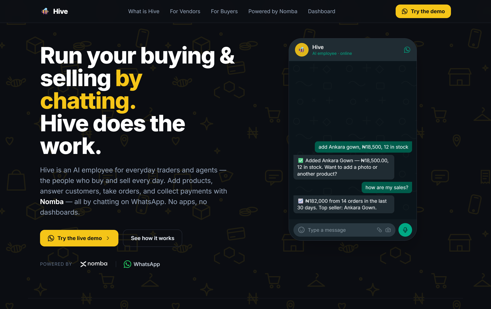
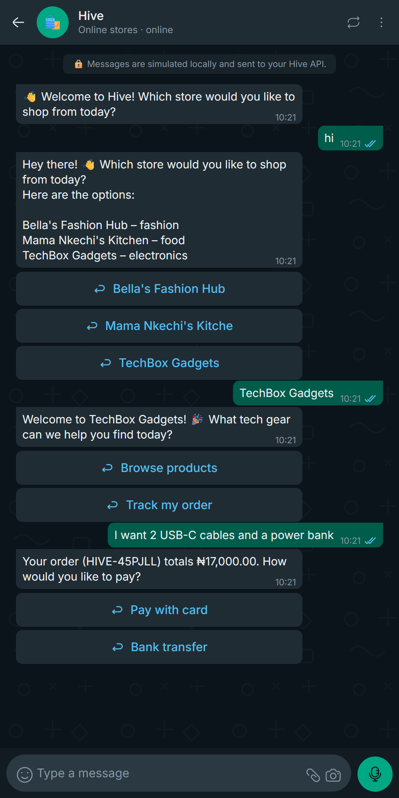
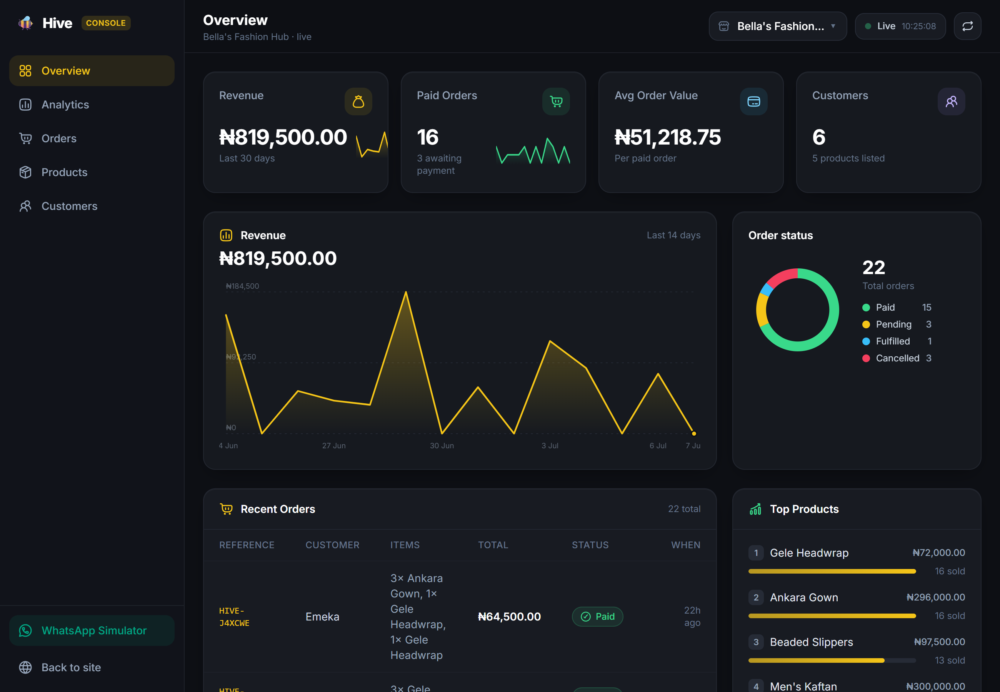

<div align="center">

# 🐝 Hive

### The first AI employee for African SMEs - buy and sell entirely by chatting on WhatsApp.

Merchants run their whole business by chatting. Customers browse, order, and pay - without ever leaving the chat.
**[Nomba](https://nomba.com)** is the money engine underneath it all.

<br/>

[](https://hive-nomba-web.vercel.app)
[](https://nomba.com)
[](https://wa.me/14155238886)

<sub>Built for the **DevCareer × Nomba Hackathon 2026** · Team Ace</sub>

<br/>



</div>

---

## The problem

Millions of African traders already run their entire business inside **WhatsApp** - DMs
for orders, screenshots for prices, "I've sent it" for payments. It works, but it doesn't
scale: no catalogue, no stock tracking, no payment confirmation, no records. Existing
e-commerce tools ask them to abandon the channel they and their customers actually live in,
download an app, and learn a dashboard. They won't.

## The solution

**Hive is an AI employee that lives in the chat they already use.** One WhatsApp number, two
sides of a real business:

<table>
<tr>
<td width="50%" valign="top">

### 🛍️ For sellers

Chat to run the shop - no app, no dashboard to learn.

- *"Add Ankara Gown, ₦18,500, 12 in stock"* - or just **send a photo** and Hive drafts the listing with AI vision.
- *"How are my sales?"* → revenue, top products, order status.
- Auto-updates stock, confirms payments, and writes the receipt.
- Every order and naira is recorded - a real ledger, built by talking.

</td>
<td width="50%" valign="top">

### 🛒 For buyers

Shop and pay in the same chat - no app, no card typed into a random site.

- Pick a store, browse products, place an order in plain language.
- Hive replies with **native WhatsApp buttons** and a real **Nomba** payment link.
- Pay by card or transfer → instant confirmation right in the thread.
- Order status, receipts, and support - all in one conversation.

</td>
</tr>
</table>

---

## See it work

<div align="center">

### One WhatsApp thread: browse → order → pay



<sub>A customer picks a store from native quick-reply buttons, orders, and gets a live Nomba payment link - all inside WhatsApp.</sub>

<br/><br/>

### The live merchant dashboard - updates the instant a WhatsApp payment lands



<sub>Revenue, order-status breakdown, top products and recent orders. Read-only companion to the chat - the phone is the product. Auto-refreshes every 4s.</sub>

</div>

---

## Powered by Nomba 💚

Nomba isn't a bolt-on - it's the financial spine that makes a *conversation* into a
*transaction*:

| Capability | How Hive uses it |
|---|---|
| **Payment links** | Every order becomes a hosted Nomba checkout, dropped straight into the chat. |
| **Signed webhooks** | On payment, an HMAC-SHA256-verified webhook auto-decrements stock, flips the order to *Paid*, and fires receipts to both sides. |
| **Active verification** | Hive also polls Nomba (`/v1/transactions/accounts`) by order reference, so a payment confirms even if a webhook is delayed. |
| **Virtual accounts & refunds** | Wired for pay-by-transfer and reversals on Nomba's sandbox. |

> Running on the **Nomba sandbox** - no real money moves. Card `5434621074252808`, PIN `1234`, OTP `9999` completes a test payment end-to-end.

---

## How it's built

```
apps/
├── api/                     # Node + Express + TypeScript + Prisma
│   └── src/
│       ├── agent/           # Groq LLM, prompts, ~20-tool function-calling registry, agent loop
│       ├── integrations/    # nomba/  ·  whatsapp/ (twilio + meta, provider-switched)
│       ├── routes/          # health · chat · whatsapp/twilio webhooks · nomba webhook · dashboard
│       ├── services/        # merchant · product · customer · order · payment · analytics
│       └── utils/           # money (kobo), references
│
└── web/                     # Vite + React + Tailwind
    └── src/                 # live dashboard (polls every 4s) + pixel-faithful WhatsApp simulator
```

**The agent actually does the work.** Groq (`gpt-oss-20b`) drives a ~20-tool function-calling
loop that creates products, places orders, mints payment links and reads analytics - not a
chatbot that talks *about* the shop, an employee that *runs* it. Product photos route to a
vision model (`llama-4-scout`) that drafts the listing. One number serves both roles: Hive
routes each sender to the merchant console or the customer storefront automatically.

### Stack

`TypeScript` · `Node/Express` · `Prisma` · `Neon Postgres` · `Groq` · `Twilio WhatsApp` (+ Meta) · `Nomba` · `React/Vite/Tailwind` · deployed on `Render` + `Vercel` + `Neon`

---

## Run it locally

You can run the **entire buy-sell-pay loop** with just a database and a free Groq key.
WhatsApp and Nomba fall back to mock mode until you add their credentials.

```bash
pnpm install

cd apps/api
cp .env.example .env          # fill in DATABASE_URL + GROQ_API_KEY (see table below)
pnpm db:push                  # create tables
pnpm db:seed                  # seed the demo store "Bella's Fashion Hub"

cd ../..
pnpm dev:all                  # API → :4000 · Dashboard → :5173 · Simulator → :5173/#/whatsapp
```

| Variable | Needed for | Notes |
|---|---|---|
| `DATABASE_URL` | always | Local Postgres or a free [Neon](https://neon.tech). |
| `GROQ_API_KEY` | the AI | Free at [console.groq.com/keys](https://console.groq.com/keys). |
| `TWILIO_*` / `WHATSAPP_*` | live WhatsApp | Optional - mock-logs replies when absent. |
| `NOMBA_*` | live payments | Optional - uses mock checkout when absent. |

### No WhatsApp account? Use the built-in simulator.

Open the **Simulator** button on the dashboard (or `/#/whatsapp`) for a pixel-faithful
WhatsApp UI wired to the *same* `/api/chat` backend - the real agent, real Nomba links, and
the live dashboard all react to it. Or hit the API directly:

```bash
# as a CUSTOMER - browse then order (any number that isn't the merchant's)
curl -s localhost:4000/api/chat -H 'content-type: application/json' \
  -d '{"phone":"2348190000002","text":"What do you sell?"}'

curl -s localhost:4000/api/chat -H 'content-type: application/json' \
  -d '{"phone":"2348190000002","text":"I want 2 Ankara Gowns and 1 Gele"}'
# → Hive replies with a Nomba payment link; paying updates stock, order & receipts.
```

---

## Roadmap

- Broadcast promotions & re-engagement to a store's customer list.
- Nomba split settlements for multi-vendor marketplaces.
- Redis-backed queue for webhook/agent processing at scale.

<div align="center">
<br/>
<sub>Made with 🐝 for African traders - the people who buy and sell every day.</sub>
</div>
